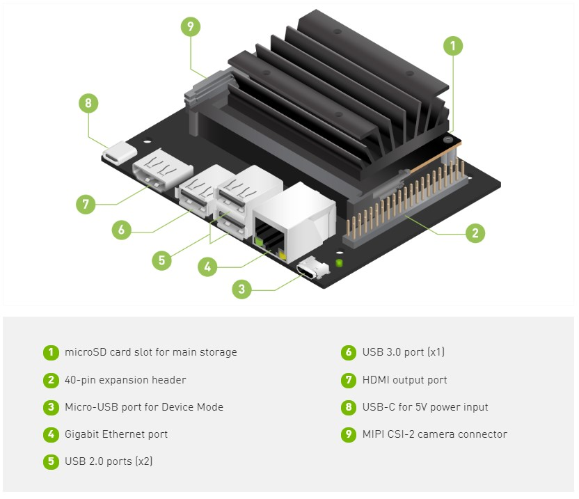
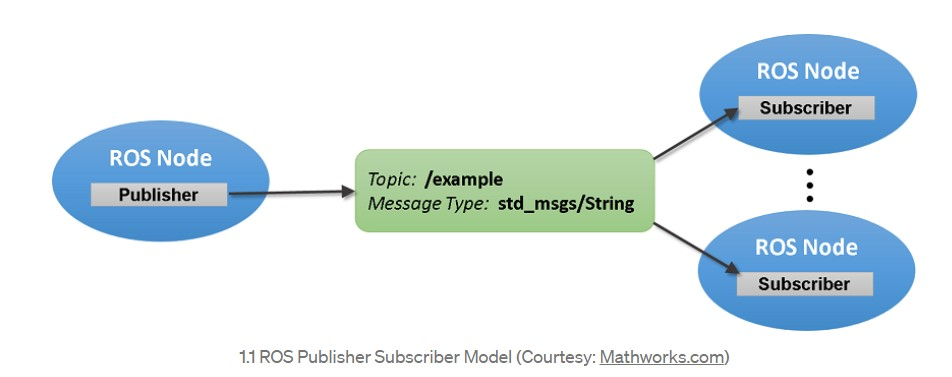

# LiDAR


## Jetson Nano Specifications


- GPU: 128-core NVIDIA Maxwell™ architecture-based GPU
- CPU: Quad-core ARM® A57
- Video: 4K @ 30 fps (H.264/H.265) / 4K @ 60 fps (H.264/H.265) encode and decode
- Camera: MIPI CSI-2 DPHY lanes, 12x (Module) and 1x (Developer Kit)
- Memory: 2GB 64-bit LPDDR4; 25.6 gigabytes/second
- Connectivity: Gigabit Ethernet
- OS Support: Linux for Tegra®
- Module Size: 70mm x 45mm
- Developer Kit Size: 100mm x 80mm




#### TODO  Hardware setup

----
## ROS Introduction

- ROS is an open-source, meta-operating system for your robot. It provides the services you would expect from an operating system, including hardware abstraction, low-level device control, implementation of commonly-used functionality, message-passing between processes, and package management. It also provides tools and libraries for obtaining, building, writing, and running code across multiple computers. 

- The ROS runtime "graph" is a peer-to-peer network of processes (potentially distributed across machines) that are loosely coupled using the ROS communication infrastructure. ROS implements several different styles of communication, including synchronous RPC-style communication over services, asynchronous streaming of data over topics, and storage of data on a Parameter Server. 

- ROS,  is designed around complex mobile manipulation platforms, with actuated sensing (tilting lasers, pan/tilt sensor heads, sensors attached to arms).  As compared to Player, ROS makes it easier to take advantage of a distributed computing environment, and I would say that the higher-level side of things is more developed in ROS than in Player.  Whereas Player offers more hardware drivers, ROS offers more implementations of algorithms.

## Operating System
- ROS currently only runs on Unix-based platforms. Software for ROS is primarily tested on Ubuntu and Mac OS X systems, though the ROS community has been contributing support for Fedora, Gentoo, Arch Linux and other Linux platforms. We will work with Linux systems in this documentation.

## Level of Concepts

Refer this [link](http://wiki.ros.org/ROS/Concepts) for level of concepts. 

## Publisher- Subscriber model

Message passing in ROS happens with the Publisher Subscriber Interface provided by ROS library functions.

- A ROS Node can be a Publisher or a Subscriber. A Publisher is the one puts the messages of some standard Message Type to a particular Topic. The Subscriber on the other hand subscribes to the Topic so that it receives the messages whenever any message is published to the Topic.

 #### Note
 A publisher can publish to one or more Topic and a Subscriber can subscribe to one or more Topic.
 Publishers and subscribers are not aware of each others’ existence. The idea is to decouple the production of information from its consumption and all the IP addresses of various nodes are tracked by the ROS Master.

 

Try out a small tutorial in the [link](https://medium.com/swlh/part-3-create-your-first-ros-publisher-and-subscriber-nodes-2e833dea7598#:~:text=A%20ROS%20Node%20can%20be,is%20published%20to%20the%20Topic.).

## ROS installation in Ubuntu 20.04

Follow the steps in this [link](https://wiki.ros.org/noetic/Installation/Ubuntu) to install ROS in your system. All the installed packages are ready to use so you don't have to build from source. 


## Visualisation of LiDAR Data with ROS

For general cloning and information, refer to this [link](https://github.com/RoboSense-LiDAR/rslidar_sdk/blob/main/README.md). Please note that you do not have to follow any steps mentioned there. It is just for your reference and understanding. You can follow the steps mentioned here.

## Configuration before launch

- Open the *CMakeLists.txt* in the project，modify the line  on top of the file **set(COMPILE_METHOD ORIGINAL)** to **set(COMPILE_METHOD CATKIN)**.

```cmake
#=======================================
# Compile setup (ORIGINAL,CATKIN,COLCON)
#=======================================
set(COMPILE_METHOD CATKIN)
```

- Copy the file *package_ros1.xml*  in the rslidar_sdk to *package.xml*

- Create a new workspace folder, and create a *src* folder in it with the following command.

```sh
mkdir -p catkin_ws/src
```

- Then clone the *rslidar_sdk* project into the *src* folder with the following command.

```sh
git clone https://github.com/RoboSense-LiDAR/rslidar_sdk.git
```

- Next step, run the following commands.

```sh
cd rslidar_sdk
git submodule init
git submodule update
```

- Go to the ```rslidar_sdk/config/config.yaml``` file and change the ```lidar_type``` to ```RS16```.

## Launch command to view the point cloud in rviz

- Inside the ```catkin_ws``` folder, run ```catkin_make```.
- Once the build is successful, run the below commands.

```sh
source devel/setup.bash
roslaunch rslidar_sdk start.launch
```